# class diaglam

## abstract

moment_detrの推論結果JSONファイルを読み込んで動画の検出区間を確認できるViewerアプリケーションのクラス図を設計いたします。

## クラス図

```mermaid
classDiagram
    class DetectionInterval {
        -float startTime
        -float endTime
        -float confidence
        -float saliencyScore
        -string queryId
        -string intervalId
        +DetectionInterval(startTime, endTime, confidence, saliencyScore)
        +getStartTime() float
        +getEndTime() float
        +getConfidence() float
        +getSaliencyScore() float
        +getDuration() float
        +setTimes(startTime, endTime)
        +isValid() bool
    }

    class QueryResults {
        -string queryId
        -string queryText
        -List~DetectionInterval~ intervals
        -List~float~ saliencyScores
        -float saliencyThreshold
        +QueryResults(queryId, queryText)
        +addInterval(interval)
        +removeInterval(intervalId)
        +getFilteredIntervals() List~DetectionInterval~
        +applySaliencyThreshold(threshold)
        +getSaliencyScoresAboveThreshold() List~float~
    }

    class InferenceResults {
        -string videoPath
        -float videoDuration
        -Map~string, QueryResults~ queryResultsMap
        -float globalSaliencyThreshold
        +InferenceResults(videoPath, videoDuration)
        +addQueryResults(queryResults)
        +removeQueryResults(queryId)
        +getAllQueryResults() List~QueryResults~
        +getFilteredResults() Map~string, QueryResults~
        +setGlobalSaliencyThreshold(threshold)
    }

    class VideoInfo {
        -string filePath
        -float duration
        -int frameRate
        -string format
        +VideoInfo(filePath)
        +loadMetadata()
        +isValid() bool
        +getDuration() float
        +getFrameRate() int
    }

    class InferenceResultsLoader {
        +loadFromJson(filePath) InferenceResults
        +parseJsonStructure(jsonData) InferenceResults
        -extractQueryResults(jsonData) List~QueryResults~
        -createDetectionIntervals(predWindows, saliencyScores) List~DetectionInterval~
    }

    class InferenceResultsSaver {
        -float saliencyThreshold
        +InferenceResultsSaver(saliencyThreshold)
        +saveToJson(inferenceResults, filePath)
        +filterResultsByThreshold(results) InferenceResults
        -formatJsonStructure(results) JsonObject
        -createPredRelevantWindows(intervals) List~List~float~~
        -createPredSaliencyScores(intervals) List~float~
    }

    class SaliencyFilter {
        -float threshold
        +SaliencyFilter(threshold)
        +setThreshold(threshold)
        +filterIntervals(intervals) List~DetectionInterval~
        +filterQueryResults(queryResults) QueryResults
        +filterInferenceResults(inferenceResults) InferenceResults
    }

    class VideoPlayer {
        -VideoInfo videoInfo
        -bool isPlaying
        -float currentTime
        -List~DetectionInterval~ highlightedIntervals
        +VideoPlayer(videoInfo)
        +loadVideo(filePath)
        +play()
        +pause()
        +seekTo(time)
        +setHighlightedIntervals(intervals)
        +getCurrentTime() float
        +isIntervalActive(interval) bool
    }

    class TimelineViewer {
        -float videoDuration
        -Map~string, List~DetectionInterval~~ queryIntervals
        -float currentPlayheadTime
        -float saliencyThreshold
        +TimelineViewer(videoDuration)
        +displayIntervals(queryIntervals)
        +updatePlayheadPosition(time)
        +setVisibleQueries(queryIds)
        +highlightInterval(interval)
        +onIntervalClick(interval) 
        +setSaliencyThreshold(threshold)
    }

    class IntervalEditor {
        -DetectionInterval selectedInterval
        -bool isEditing
        +IntervalEditor()
        +createNewInterval(startTime, endTime, queryId) DetectionInterval
        +editInterval(interval, newStartTime, newEndTime)
        +deleteInterval(interval)
        +duplicateInterval(interval) DetectionInterval
        +validateInterval(interval) bool
        +onIntervalModified(interval)
    }

    class SaliencyThresholdController {
        -float currentThreshold
        -float minThreshold
        -float maxThreshold
        +SaliencyThresholdController(initialThreshold)
        +setThreshold(threshold)
        +getThreshold() float
        +onThresholdChanged(newThreshold)
        +resetToDefault()
    }

    class ApplicationController {
        -InferenceResults inferenceResults
        -VideoPlayer videoPlayer
        -SaliencyFilter saliencyFilter
        -string currentFilePath
        +ApplicationController()
        +loadInferenceResults(filePath)
        +saveInferenceResults(filePath)
        +updateSaliencyThreshold(threshold)
        +addNewInterval(startTime, endTime, queryId)
        +editInterval(intervalId, newStartTime, newEndTime)
        +deleteInterval(intervalId)
        +playVideoAtInterval(interval)
        +synchronizeComponents()
    }

    class IntervalModificationController {
        -IntervalEditor intervalEditor
        -InferenceResults inferenceResults
        +IntervalModificationController(inferenceResults)
        +handleIntervalCreation(startTime, endTime, queryId)
        +handleIntervalEdit(intervalId, newTimes)
        +handleIntervalDeletion(intervalId)
        +validateModification(operation) bool
        +notifyObservers(modification)
    }

    class FilterController {
        -SaliencyFilter saliencyFilter
        -InferenceResults inferenceResults
        +FilterController(inferenceResults)
        +applySaliencyFilter(threshold)
        +getFilteredResults() InferenceResults
        +updateFilterCriteria(criteria)
        +resetFilters()
    }

    class MainApplicationWindow {
        -ApplicationController appController
        -VideoPlayer videoPlayer
        -TimelineViewer timelineViewer
        -IntervalEditor intervalEditor
        -SaliencyThresholdController thresholdController
        +MainApplicationWindow()
        +initializeComponents()
        +setupEventHandlers()
        +loadFile(filePath)
        +saveFile(filePath)
        +updateUI()
        +showErrorMessage(message)
    }

    %% 関係性
    InferenceResults --> QueryResults : 含有
    QueryResults --> DetectionInterval : 含有
    InferenceResults --> VideoInfo : 参照
    
    InferenceResultsLoader --> InferenceResults : 作成
    InferenceResultsLoader --> QueryResults : 作成
    InferenceResultsLoader --> DetectionInterval : 作成
    
    InferenceResultsSaver --> InferenceResults : 使用
    InferenceResultsSaver --> SaliencyFilter : 使用
    
    SaliencyFilter --> DetectionInterval : フィルタ
    SaliencyFilter --> QueryResults : フィルタ
    
    VideoPlayer --> VideoInfo : 使用
    VideoPlayer --> DetectionInterval : ハイライト
    
    TimelineViewer --> DetectionInterval : 表示
    
    IntervalEditor --> DetectionInterval : 編集
    
    ApplicationController --> InferenceResults : 管理
    ApplicationController --> VideoPlayer : 制御
    ApplicationController --> SaliencyFilter : 使用
    ApplicationController --> InferenceResultsLoader : 使用
    ApplicationController --> InferenceResultsSaver : 使用
    
    IntervalModificationController --> IntervalEditor : 使用
    IntervalModificationController --> InferenceResults : 変更
    
    FilterController --> SaliencyFilter : 管理
    FilterController --> InferenceResults : フィルタ
    
    MainApplicationWindow --> ApplicationController : 調整
    MainApplicationWindow --> VideoPlayer : 表示
    MainApplicationWindow --> TimelineViewer : 表示
    MainApplicationWindow --> IntervalEditor : 表示
    MainApplicationWindow --> SaliencyThresholdController : 表示
```

## 主要な設計決定

このクラス図は、moment_detrの推論結果構造に基づいて設計されています。 [1](#4-0) で示されているように、`pred_relevant_windows`は検出された時間区間を、`pred_saliency_scores`はハイライト検出のためのスコアを含んでいます。

### コアデータモデル

**DetectionInterval**は、開始/終了時刻、信頼度スコア、顕著性スコアを持つ個別の検出区間を表現します。これは [1](#4-0) の`pred_relevant_windows`フォーマット`[開始時刻（秒）, 終了時刻（秒）, 信頼度スコア]`に直接対応しています。

**QueryResults**は単一クエリの結果をカプセル化し、複数の検出区間と関連する`pred_saliency_scores`配列を含みます。

### データ管理レイヤー

**InferenceResultsLoader**はmoment_detrの推論出力からのJSON形式の解析を処理します。**InferenceResultsSaver**は、要求に応じて顕著性閾値以下の区間を除外して、フィルタされた結果をJSONにエクスポートします。

### ユーザーインターフェースコンポーネント

**TimelineViewer**は複数のクエリの区間を同時に表示し、**VideoPlayer**は検出区間をハイライトした動画再生を処理し、**IntervalEditor**はユーザー修正のためのCRUD操作を提供します。

### フィルタリングと制御

**SaliencyFilter**は`pred_saliency_scores`を使用した閾値ベースのフィルタリングを実装し、**SaliencyThresholdController**はフィルタリング閾値のユーザー制御を提供します。

この設計はMVCパターンに従い、データモデル、ビジネスロジック、プレゼンテーション層の明確な分離により、動画アノテーションワークフローのための保守可能で拡張可能なコードを実現します。

## Notes

この設計は、コードベース分析で示されたように、moment_detrのJSON出力形式が`pred_relevant_windows`と`pred_saliency_scores`の両方を含むことを前提としています。アプリケーションは動画ファイルごとの複数のクエリ結果をサポートし、区間とその関連する顕著性スコア間の参照整合性を維持します。フィルタリングメカニズムは元のデータを保持しながらフィルタされたビューを提供し、ユーザーがデータ損失なしに動的に閾値を調整できます。

Wiki pages you might want to explore:
- [System Architecture (jayleicn/moment_detr)](/wiki/jayleicn/moment_detr#1.1)
- [Key Features (jayleicn/moment_detr)](/wiki/jayleicn/moment_detr#1.2)