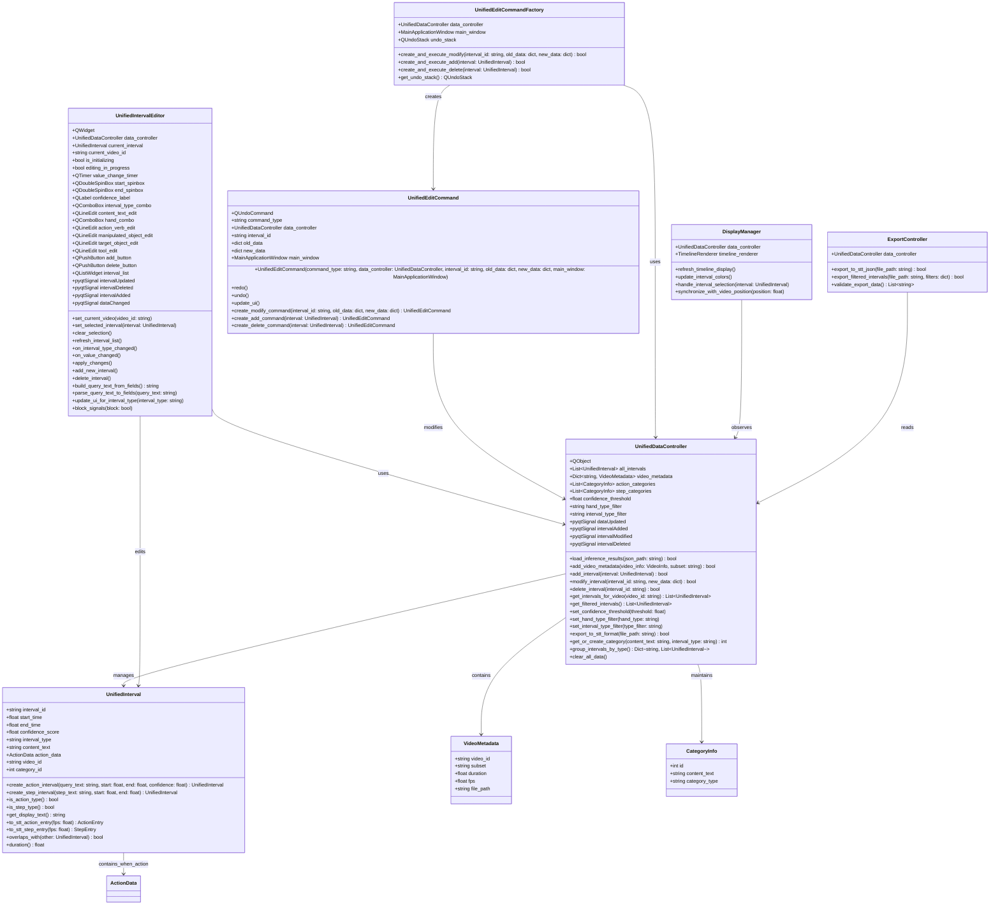

```mermaid
classDiagram  
    class UnifiedInterval {  
        +string interval_id  
        +float start_time  
        +float end_time  
        +float confidence_score  
        +string interval_type  
        +string content_text  
        +ActionData action_data  
        +string video_id  
        +int category_id  
        +create_action_interval(query_text: string, start: float, end: float, confidence: float) UnifiedInterval  
        +create_step_interval(step_text: string, start: float, end: float) UnifiedInterval  
        +is_action_type() bool  
        +is_step_type() bool  
        +get_display_text() string  
        +to_stt_action_entry(fps: float) ActionEntry  
        +to_stt_step_entry(fps: float) StepEntry  
        +overlaps_with(other: UnifiedInterval) bool  
        +duration() float  
    }  

    class UnifiedDataController {  
        +QObject  
        +List~UnifiedInterval~ all_intervals  
        +Dict~string, VideoMetadata~ video_metadata  
        +List~CategoryInfo~ action_categories  
        +List~CategoryInfo~ step_categories  
        +float confidence_threshold  
        +string hand_type_filter  
        +string interval_type_filter  
        +pyqtSignal dataUpdated  
        +pyqtSignal intervalAdded  
        +pyqtSignal intervalModified  
        +pyqtSignal intervalDeleted  
        +load_inference_results(json_path: string) bool  
        +add_video_metadata(video_info: VideoInfo, subset: string) bool  
        +add_interval(interval: UnifiedInterval) bool  
        +modify_interval(interval_id: string, new_data: dict) bool  
        +delete_interval(interval_id: string) bool  
        +get_intervals_for_video(video_id: string) List~UnifiedInterval~  
        +get_filtered_intervals() List~UnifiedInterval~  
        +set_confidence_threshold(threshold: float)  
        +set_hand_type_filter(hand_type: string)  
        +set_interval_type_filter(type_filter: string)  
        +export_to_stt_format(file_path: string) bool  
        +get_or_create_category(content_text: string, interval_type: string) int  
        +group_intervals_by_type() Dict~string, List~UnifiedInterval~~  
        +clear_all_data()  
    }  

    class VideoMetadata {  
        +string video_id  
        +string subset  
        +float duration  
        +float fps  
        +string file_path  
    }  

    class CategoryInfo {  
        +int id  
        +string content_text  
        +string category_type  
    }  

    class UnifiedIntervalEditor {  
        +QWidget  
        +UnifiedDataController data_controller  
        +UnifiedInterval current_interval  
        +string current_video_id  
        +bool is_initializing  
        +bool editing_in_progress  
        +QTimer value_change_timer  
        +QDoubleSpinBox start_spinbox  
        +QDoubleSpinBox end_spinbox  
        +QLabel confidence_label  
        +QComboBox interval_type_combo  
        +QLineEdit content_text_edit  
        +QComboBox hand_combo  
        +QLineEdit action_verb_edit  
        +QLineEdit manipulated_object_edit  
        +QLineEdit target_object_edit  
        +QLineEdit tool_edit  
        +QPushButton add_button  
        +QPushButton delete_button  
        +QListWidget interval_list  
        +pyqtSignal intervalUpdated  
        +pyqtSignal intervalDeleted  
        +pyqtSignal intervalAdded  
        +pyqtSignal dataChanged  
        +set_current_video(video_id: string)  
        +set_selected_interval(interval: UnifiedInterval)  
        +clear_selection()  
        +refresh_interval_list()  
        +on_interval_type_changed()  
        +on_value_changed()  
        +apply_changes()  
        +add_new_interval()  
        +delete_interval()  
        +build_query_text_from_fields() string  
        +parse_query_text_to_fields(query_text: string)  
        +update_ui_for_interval_type(interval_type: string)  
        +block_signals(block: bool)  
    }  

    class UnifiedEditCommand {  
        +QUndoCommand  
        +string command_type  
        +UnifiedDataController data_controller  
        +string interval_id  
        +dict old_data  
        +dict new_data  
        +MainApplicationWindow main_window  
        +UnifiedEditCommand(command_type: string, data_controller: UnifiedDataController, interval_id: string, old_data: dict, new_data: dict, main_window: MainApplicationWindow)  
        +redo()  
        +undo()  
        +update_ui()  
        +create_modify_command(interval_id: string, old_data: dict, new_data: dict) UnifiedEditCommand  
        +create_add_command(interval: UnifiedInterval) UnifiedEditCommand  
        +create_delete_command(interval: UnifiedInterval) UnifiedEditCommand  
    }  

    class UnifiedEditCommandFactory {  
        +UnifiedDataController data_controller  
        +MainApplicationWindow main_window  
        +QUndoStack undo_stack  
        +create_and_execute_modify(interval_id: string, old_data: dict, new_data: dict) bool  
        +create_and_execute_add(interval: UnifiedInterval) bool  
        +create_and_execute_delete(interval: UnifiedInterval) bool  
        +get_undo_stack() QUndoStack  
    }  

    class DisplayManager {  
        +UnifiedDataController data_controller  
        +TimelineRenderer timeline_renderer  
        +refresh_timeline_display()  
        +update_interval_colors()  
        +handle_interval_selection(interval: UnifiedInterval)  
        +synchronize_with_video_position(position: float)  
    }  

    class ExportController {  
        +UnifiedDataController data_controller  
        +export_to_stt_json(file_path: string) bool  
        +export_filtered_intervals(file_path: string, filters: dict) bool  
        +validate_export_data() List~string~  
    }  

    UnifiedDataController --> UnifiedInterval : manages  
    UnifiedDataController --> VideoMetadata : contains  
    UnifiedDataController --> CategoryInfo : maintains  
    UnifiedIntervalEditor --> UnifiedDataController : uses  
    UnifiedIntervalEditor --> UnifiedInterval : edits  
    UnifiedEditCommand --> UnifiedDataController : modifies  
    UnifiedEditCommandFactory --> UnifiedEditCommand : creates  
    UnifiedEditCommandFactory --> UnifiedDataController : uses  
    DisplayManager --> UnifiedDataController : observes  
    ExportController --> UnifiedDataController : reads  
    UnifiedInterval --> ActionData : contains_when_action  
```