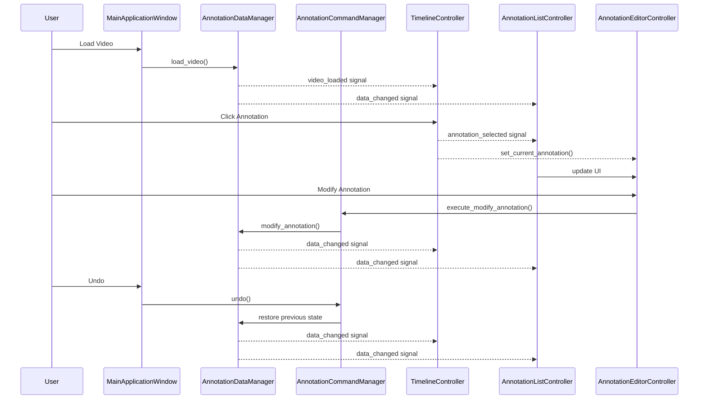
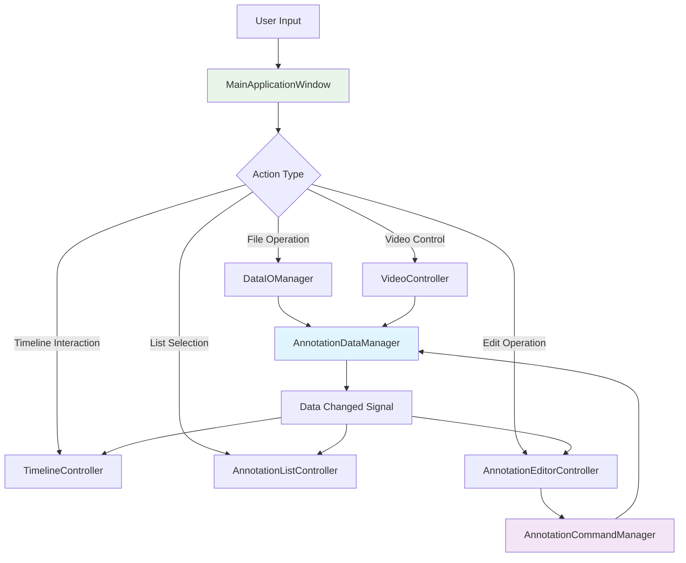

# class_diagram.md

# Refactored Video Annotation Tool - Class Diagram

## Overall Architecture (Mermaid)

```mermaid
classDiagram
    %% Main Application Layer
    class MainApplicationWindow {
        -logger: Logger
        -data_manager: AnnotationDataManager
        -command_manager: AnnotationCommandManager
        -io_manager: DataIOManager
        -video_controller: VideoController
        -timeline_controller: TimelineController
        -list_controller: AnnotationListController
        -editor_controller: AnnotationEditorController
        -current_video_path: Optional[str]
        +__init__()
        +_setup_logging()
        +_setup_ui()
        +_setup_connections()
        +_setup_menus()
        +_setup_shortcuts()
        +_create_left_panel() QWidget
        +_create_right_panel() QWidget
        +open_video()
        +load_video(video_path: str)
        +load_inference_results()
        +export_stt_dataset()
        +export_inference_results()
        +create_new_annotation(annotation_type: str)
        +delete_selected_annotation()
        +clear_selection()
        +main() static
    }

    %% Data Management Layer
    class AnnotationDataManager {
        <<QObject>>
        -logger: Logger
        -video_info: Optional[VideoInfo]
        -annotations: List[AnnotationItem]
        -confidence_threshold: float
        -_next_id: int
        +data_changed: pyqtSignal
        +annotation_added: pyqtSignal
        +annotation_modified: pyqtSignal
        +annotation_deleted: pyqtSignal
        +video_loaded: pyqtSignal
        +__init__()
        +load_video(video_path: str, video_info: VideoInfo)
        +add_annotation(...) AnnotationItem
        +modify_annotation(index: int, **updates) bool
        +delete_annotation(index: int) bool
        +get_annotation_by_id(annotation_id: str) Optional[AnnotationItem]
        +get_annotations_by_type(annotation_type: str) List[AnnotationItem]
        +get_filtered_annotations() List[AnnotationItem]
        +set_confidence_threshold(threshold: float)
        +get_statistics() Dict[str, Any]
    }

    class AnnotationItem {
        <<dataclass>>
        +id: str
        +start_time: float
        +end_time: float
        +confidence_score: float
        +annotation_type: str
        +category: str
        +hand_type: Optional[str]
        +object_name: Optional[str]
        +verb: Optional[str]
        +video_id: Optional[str]
        +created_at: Optional[datetime]
        +modified_at: Optional[datetime]
        +__post_init__()
    }

    class VideoInfo {
        <<dataclass>>
        +video_id: str
        +video_path: str
        +duration: float
        +fps: float
        +width: int
        +height: int
    }

    %% Command Management Layer
    class AnnotationCommandManager {
        <<QObject>>
        -logger: Logger
        -data_manager: AnnotationDataManager
        -undo_stack: QUndoStack
        +command_executed: pyqtSignal
        +undo_available: pyqtSignal
        +redo_available: pyqtSignal
        +__init__(data_manager: AnnotationDataManager)
        +execute_add_annotation(...)
        +execute_modify_annotation(...)
        +execute_delete_annotation(annotation_id: str)
        +undo()
        +redo()
        +clear()
        +get_undo_stack() QUndoStack
    }

    class AnnotationCommand {
        <<abstract>>
        -data_manager: AnnotationDataManager
        -logger: Logger
        +__init__(data_manager: AnnotationDataManager, description: str)
        +redo() abstract
        +undo() abstract
    }

    class AddAnnotationCommand {
        -annotation_type: str
        -start_time: float
        -end_time: float
        -category: str
        -confidence_score: float
        -kwargs: dict
        -annotation: Optional[AnnotationItem]
        -index: int
        +redo()
        +undo()
    }

    class ModifyAnnotationCommand {
        -annotation_id: str
        -old_values: Dict[str, Any]
        -new_values: Dict[str, Any]
        +redo()
        +undo()
    }

    class DeleteAnnotationCommand {
        -annotation_id: str
        -annotation: Optional[AnnotationItem]
        -index: int
        +redo()
        +undo()
    }

    %% Data I/O Layer
    class DataIOManager {
        <<QObject>>
        -logger: Logger
        -data_manager: AnnotationDataManager
        +data_imported: pyqtSignal
        +data_exported: pyqtSignal
        +__init__(data_manager: AnnotationDataManager)
        +import_inference_results(file_path: str) bool
        +export_to_stt_format(file_path: str, confidence_threshold: float) bool
        +export_inference_results(file_path: str) bool
        +load_video_metadata(video_path: str) Optional[VideoInfo]
        -_convert_inference_to_annotations(data: Dict) List[AnnotationItem]
        -_convert_annotations_to_stt(confidence_threshold: float) Dict
        -_convert_annotations_to_inference() Dict
    }

    %% Video Control Layer
    class VideoController {
        <<QObject>>
        -logger: Logger
        -current_video_path: str
        -current_video_info: Optional[VideoInfo]
        -media_player: QMediaPlayer
        -audio_output: QAudioOutput
        -video_widget: QVideoWidget
        -control_widget: QWidget
        -position_slider: QSlider
        -play_button: QPushButton
        -position_timer: QTimer
        +video_loaded: pyqtSignal
        +position_changed: pyqtSignal
        +duration_changed: pyqtSignal
        +playback_state_changed: pyqtSignal
        +__init__()
        +load_video(video_path: str, video_info: Optional[VideoInfo]) bool
        +play()
        +pause()
        +stop()
        +toggle_playback()
        +seek_to_time(seconds: float)
        +seek_relative(seconds: float)
        +get_position_seconds() float
        +get_duration_seconds() float
        +get_video_widget() QVideoWidget
        +get_control_widget() QWidget
    }

    %% Timeline Control Layer
    class TimelineController {
        <<QObject>>
        -logger: Logger
        -data_manager: AnnotationDataManager
        -timeline_widget: QWidget
        -tracks: Dict[str, TimelineTrack]
        -video_duration: float
        -current_position: float
        +interval_clicked: pyqtSignal
        +interval_drag_started: pyqtSignal
        +interval_drag_moved: pyqtSignal
        +interval_drag_finished: pyqtSignal
        +new_interval_created: pyqtSignal
        +position_clicked: pyqtSignal
        +__init__(data_manager: AnnotationDataManager)
        +set_video_duration(duration: float)
        +set_current_position(position: float)
        +set_highlighted_annotation(annotation: Optional[AnnotationItem])
        +update_timeline()
        +get_timeline_widget() QWidget
        +clear_highlights()
    }

    class TimelineTrack {
        <<QWidget>>
        -annotation_type: str
        -track_height: int
        -logger: Logger
        -annotations: List[AnnotationItem]
        -video_duration: float
        -current_position: float
        -pixels_per_second: float
        -dragging_annotation: Optional[AnnotationItem]
        -highlighted_annotation: Optional[AnnotationItem]
        -colors: dict
        +interval_clicked: pyqtSignal
        +interval_drag_started: pyqtSignal
        +interval_drag_moved: pyqtSignal
        +interval_drag_finished: pyqtSignal
        +new_interval_created: pyqtSignal
        +position_clicked: pyqtSignal
        +__init__(annotation_type: str, track_height: int)
        +set_annotations(annotations: List[AnnotationItem])
        +set_video_duration(duration: float)
        +set_current_position(position: float)
        +set_highlighted_annotation(annotation: Optional[AnnotationItem])
        +paintEvent(event)
        +mousePressEvent(event)
        +mouseMoveEvent(event)
        +mouseReleaseEvent(event)
    }

    %% List Control Layer
    class AnnotationListController {
        <<QObject>>
        -logger: Logger
        -data_manager: AnnotationDataManager
        -list_widget: QListWidget
        -main_widget: QWidget
        -type_filter: QComboBox
        -confidence_slider: QSlider
        -current_type_filter: str
        -current_confidence_threshold: float
        +annotation_selected: pyqtSignal
        +filter_changed: pyqtSignal
        +__init__(data_manager: AnnotationDataManager)
        +update_list()
        +get_list_widget() QWidget
        +select_annotation(annotation: AnnotationItem)
        +get_selected_annotation() Optional[AnnotationItem]
        +set_confidence_threshold(threshold: float)
        +get_current_filters() dict
    }

    class AnnotationListItem {
        <<QListWidgetItem>>
        +annotation: AnnotationItem
        +__init__(annotation: AnnotationItem)
        +update_display()
    }

    %% Editor Control Layer
    class AnnotationEditorController {
        <<QObject>>
        -logger: Logger
        -data_manager: AnnotationDataManager
        -command_manager: AnnotationCommandManager
        -tab_widget: QTabWidget
        -action_editor: ActionEditor
        -step_editor: StepEditor
        -current_annotation: Optional[AnnotationItem]
        +annotation_modified: pyqtSignal
        +annotation_deleted: pyqtSignal
        +__init__(data_manager: AnnotationDataManager, command_manager: AnnotationCommandManager)
        +set_current_annotation(annotation: AnnotationItem)
        +clear_current_annotation()
        +get_editor_widget() QTabWidget
        +apply_annotation_changes(annotation: AnnotationItem, new_values: Dict)
        +delete_current_annotation()
        +get_current_tab_type() str
    }

    class ActionEditor {
        <<QWidget>>
        -logger: Logger
        -current_annotation: Optional[AnnotationItem]
        -start_time_spin: QDoubleSpinBox
        -end_time_spin: QDoubleSpinBox
        -confidence_spin: QDoubleSpinBox
        -category_edit: QLineEdit
        -hand_type_combo: QComboBox
        -object_edit: QLineEdit
        -verb_edit: QLineEdit
        +__init__()
        +setup_ui()
        +set_annotation(annotation: AnnotationItem)
        +update_fields()
        +get_current_values() Dict[str, Any]
        +apply_changes()
        +reset_fields()
        +delete_annotation()
        +clear()
        +set_enabled(enabled: bool)
    }

    class StepEditor {
        <<QWidget>>
        -logger: Logger
        -current_annotation: Optional[AnnotationItem]
        -start_time_spin: QDoubleSpinBox
        -end_time_spin: QDoubleSpinBox
        -confidence_spin: QDoubleSpinBox
        -step_text_edit: QTextEdit
        +__init__()
        +setup_ui()
        +set_annotation(annotation: AnnotationItem)
        +update_fields()
        +get_current_values() Dict[str, Any]
        +apply_changes()
        +reset_fields()
        +delete_annotation()
        +clear()
        +set_enabled(enabled: bool)
    }

    %% Relationships
    MainApplicationWindow --> AnnotationDataManager : manages
    MainApplicationWindow --> AnnotationCommandManager : uses
    MainApplicationWindow --> DataIOManager : uses
    MainApplicationWindow --> VideoController : uses
    MainApplicationWindow --> TimelineController : uses
    MainApplicationWindow --> AnnotationListController : uses
    MainApplicationWindow --> AnnotationEditorController : uses

    AnnotationDataManager --> AnnotationItem : contains
    AnnotationDataManager --> VideoInfo : contains
    
    AnnotationCommandManager --> AnnotationDataManager : modifies
    AnnotationCommandManager --> AnnotationCommand : executes
    AnnotationCommand <|-- AddAnnotationCommand
    AnnotationCommand <|-- ModifyAnnotationCommand
    AnnotationCommand <|-- DeleteAnnotationCommand

    DataIOManager --> AnnotationDataManager : reads/writes
    
    TimelineController --> AnnotationDataManager : observes
    TimelineController --> TimelineTrack : contains
    
    AnnotationListController --> AnnotationDataManager : observes
    AnnotationListController --> AnnotationListItem : creates
    
    AnnotationEditorController --> AnnotationDataManager : reads
    AnnotationEditorController --> AnnotationCommandManager : uses
    AnnotationEditorController --> ActionEditor : contains
    AnnotationEditorController --> StepEditor : contains
```

## Detailed Component Interactions

```mermaid
sequenceDiagram
    participant User
    participant MainWindow as MainApplicationWindow
    participant DataMgr as AnnotationDataManager
    participant CmdMgr as AnnotationCommandManager
    participant Timeline as TimelineController
    participant List as AnnotationListController
    participant Editor as AnnotationEditorController

    User->>MainWindow: Load Video
    MainWindow->>DataMgr: load_video()
    DataMgr-->>Timeline: video_loaded signal
    DataMgr-->>List: data_changed signal
    
    User->>Timeline: Click Annotation
    Timeline-->>List: annotation_selected signal
    Timeline-->>Editor: set_current_annotation()
    List->>Editor: update UI
    
    User->>Editor: Modify Annotation
    Editor->>CmdMgr: execute_modify_annotation()
    CmdMgr->>DataMgr: modify_annotation()
    DataMgr-->>Timeline: data_changed signal
    DataMgr-->>List: data_changed signal
    
    User->>MainWindow: Undo
    MainWindow->>CmdMgr: undo()
    CmdMgr->>DataMgr: restore previous state
    DataMgr-->>Timeline: data_changed signal
    DataMgr-->>List: data_changed signal
```

## Data Flow Architecture

```mermaid
flowchart TD
    A[User Input] --> B[MainApplicationWindow]
    B --> C{Action Type}
    
    C -->|Video Control| D[VideoController]
    C -->|Timeline Interaction| E[TimelineController]
    C -->|List Selection| F[AnnotationListController]
    C -->|Edit Operation| G[AnnotationEditorController]
    C -->|File Operation| H[DataIOManager]
    
    G --> I[AnnotationCommandManager]
    I --> J[AnnotationDataManager]
    
    H --> J
    D --> J
    
    J --> K[Data Changed Signal]
    K --> E
    K --> F
    K --> G
    
    style J fill:#e1f5fe
    style I fill:#f3e5f5
    style B fill:#e8f5e8
```
